# 1 Overview of an Eliud app
-----------------

## 1.1 Navigation

First of all, an Eliud app - in this example Minkey - consists of pages with drawers, an app bar and a bottom navigation bar.

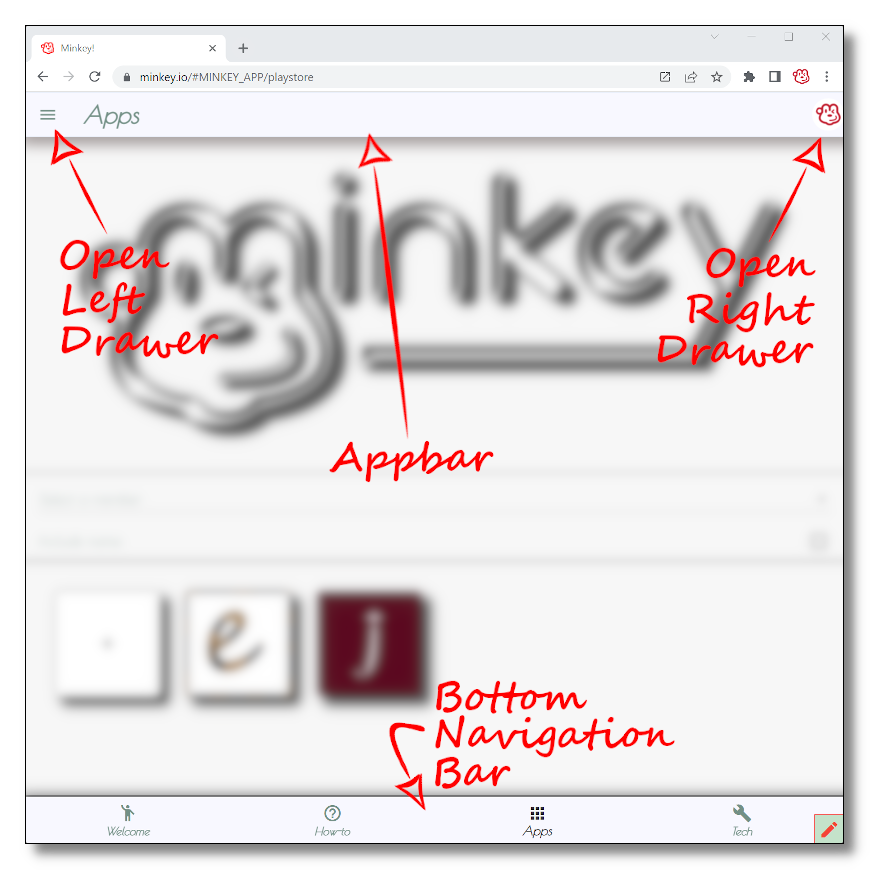

Links to pages or dialogs are available from the appbar, the bottom navigation bar and from the drawers. The appbar has icons on the left and right to open the left and right drawer. When not logged on, the appbar typically has a sign in button. We say "typically" as this totally depends on the creator of the app chooses to configure these things. Also typically, the appbar has "context dependent icons" such as a chat icon, a cart icon, a message icon respectively indicating the existance of an unread entry in a chat, an unread message or items in a shopping cart. These icons can be placed everywhere, but typcially they're placed on the appbar.

The bottom navigation bar: Icons with references to pages of your app, typically the main sections of your app.

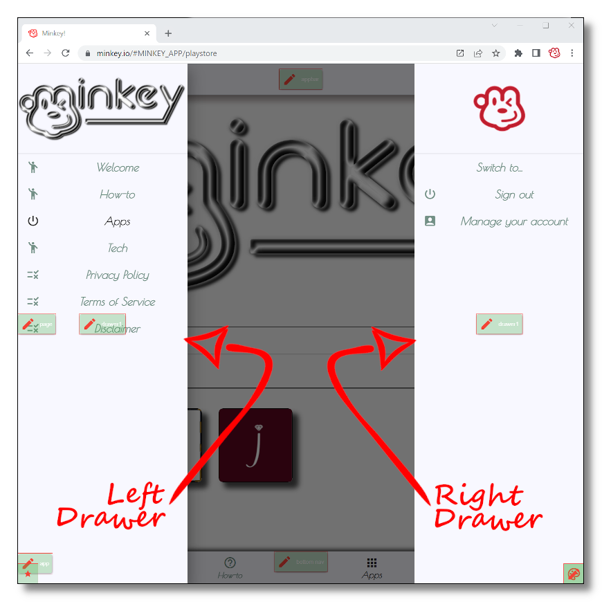

The left and right drawers also have menu items which open a page or a dialog. The left drawer typically displays the app logo and lists links to pages within the app. The right drawer typically is only accessible for people who have logged into the app and therefore this drawer typically contains the avatar of the member and a list actions of the member, for example a dialog that allows to maintain the member's account.

## 1.2 Pages, dialogs and components

Pages and dialogs consist of 1 or more components. For example:

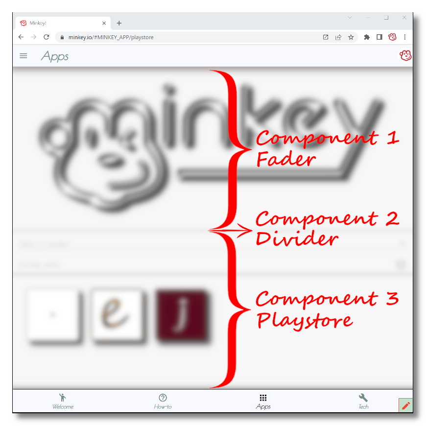

In the above example page, here the "Apps" page of the Minkey app itself, we have 3 components: a Fader, a Divider and a Playstore.

## 1.3 Privileges / access level

You might want to allow some bits to be accessible by some specific members only for example. For this, Eliud uses a concept of "privilege" to allow to secure certain parts of your app. This privilege can be: No Privilege, Level 1, Level 2 or Owner. A page and its components have a specific privilege. 

A person opening your app has a specific access level with corresponding access:

| Access level | Characteristics of person  | Access to pages, dialogs and components and images from components with privilege |
|---|---|---|
| Public       | Person has not subscribed, i.e. not logged onto the app. | No Privilege  |
| Subscribed   | Person has subscribed and logged onto the app but has not been given any access level | No Privilege |
| Level 1      |  Person has subscred and logged onto the app and has given access level 1 | Level 1 |
| Level 2      |  Person has subscred and logged onto the app and has given access level 2  | Level 2 |
| Owner        | Person has logged onto the app and is the owner | Owner |
| Blocked      |  Person has logged onto the app but has been blocked by the owner | No privilege |

Notes:

*   It should go without saying, but authentication and authorization is not managed by the app, but managed by GCP. Authentication is the process of verifying who a user is, while authorization is the process of verifying what they have access to. 
*   Blocked members can see what public can see. The app will behave in some different ways to indicate to the person that he is blocked. However, this limitation is only indicative. All the person has to do is logoff and use the app anonymously to access public info, hence no extra limitation for blocked users vs public users. If you want to limit access to data, this data needs to be specified as level 1, 2 or owner.

# 2. Editor mode
---------------

As owner of your app, you (and only you) can switch to editor mode: If you are the owner of the current app, there will be be an editor toggle mode button available at the bottom of the window.

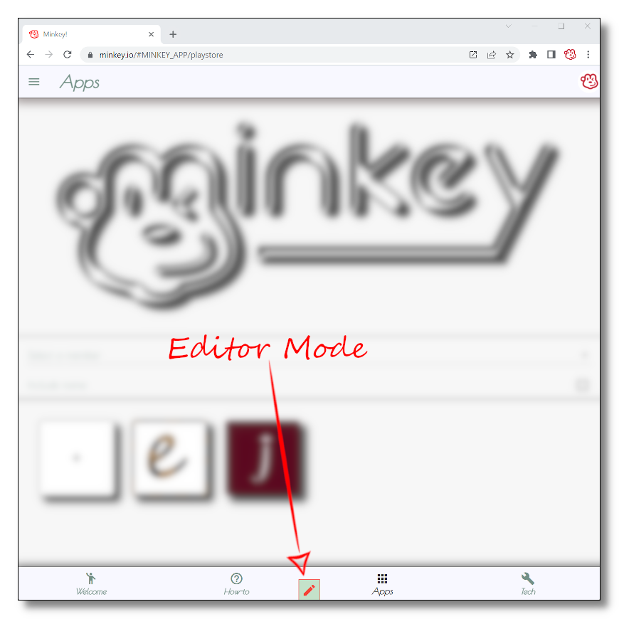

When you press the editor toggle mode button, a number of buttons will appear. These buttons allow you to construct / adjust your app. By the way, sometimes these editor buttons could be overlapping other buttons or functionality of your app. Because of this, you can move these buttons around.

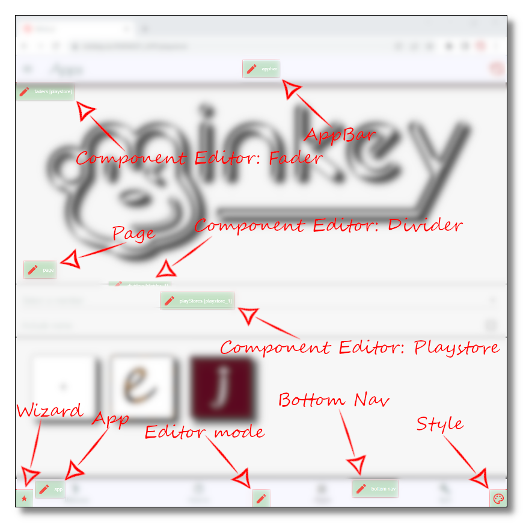

| Button                      | Description and link |
|-----------------------------|----------------------|
| Style                       | Allows to change the style of your app, see <a href="#style">2.1 Style</a> |
| Wizard                      | Allows to add functionality to your app by means of a wizard, see <a href="#wizard">2.2 Wizard</a> |
| App                         | Allows to update the app, see <a href="#app_editor">2.3 App editor</a> |
| Page                        | Allows to update the page, see <a href="#page_editor">2.4 Page editor</a> |
| AppBar                      | Allows to update the app bar, see ## <a href="#app_bar">2.5 App Bar</a> |
| Bottom Nav                  | Allows to update the bottom navigation menu, see <a href="#bottom_nav">2.6 Bottom Nav</a> |
| Component Editor: Fader     | Allows to update the component which is an editor specific to that component, here the Fader, see ## <a href="#component_editor">2.8 Component editor</a> |
| Component Editor: Divider   | Allows to update the component which is an editor specific to that component, here the Divider, see <a href="#component_editor">2.8 Component editor</a> |
| Component Editor: Playstore | Allows to update the component which is an editor specific to that component, here the Playstore, see <a href="#component_editor">2.8 Component editor</a> |

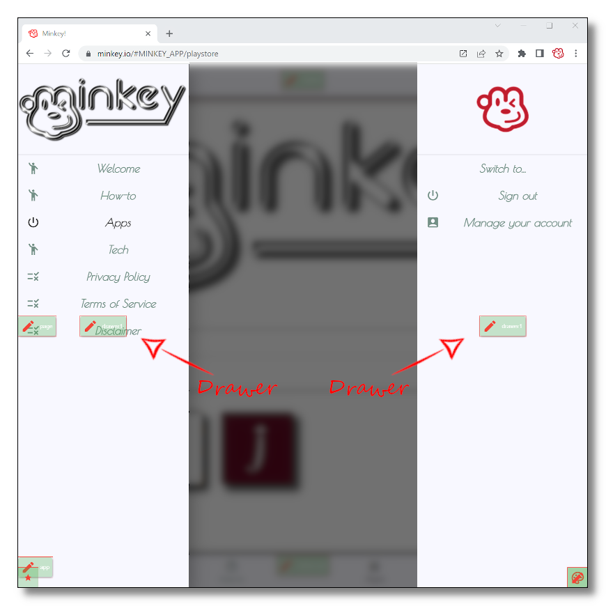

| Button | Description and link |
|--------|----------------------|
| Drawer |Allows to change the style of your drawer, see <a href="#drawer">2.7 Drawer</a> |

## <a name="style">2.1 Style</a>

The style dialog allows the app creator to use any of the pre-defined styles, to copy, to name it, and to select it as the default style.

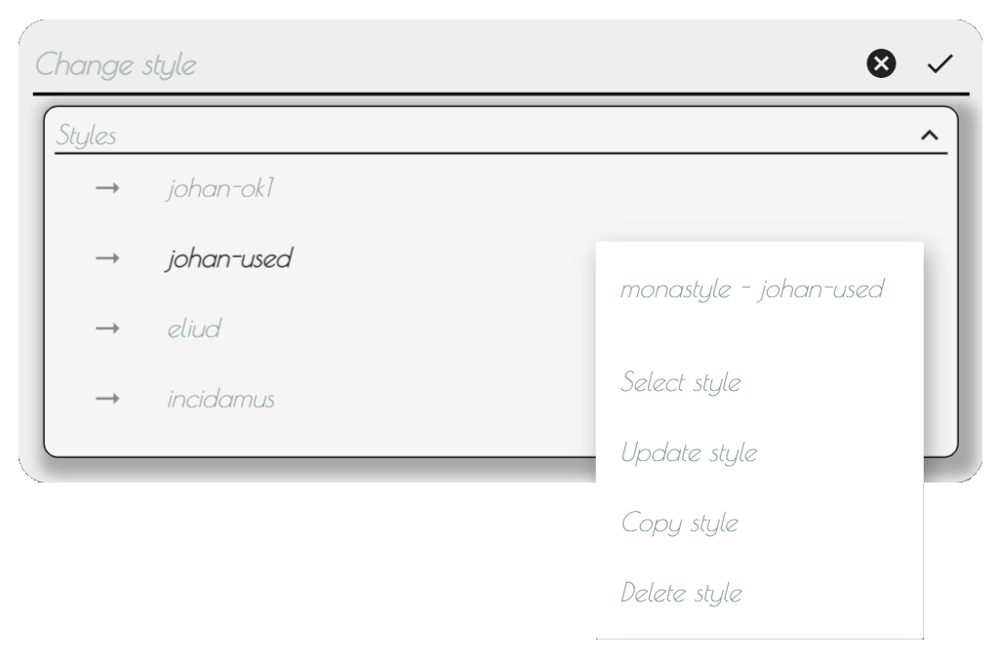

Minkey uses an API that can be implemented by plugins. A default style is provided which serves as a minimum default implementation. A "nicer" implementation has been made available by the plugin "eliud\_stl\_mona". Use the on screen instructions to copy, configure and select the style for your app. Recommended is that you copy one of the predefined styles into your own style and configure. Don't forget to make it the active style.

## <a name="wizard">2.2 Wizard</a>

An app consists of one or more pages. Pages can be created through the various editors, more on that later. However, to simplify things, most plugins come with wizards to simplify the creation of the components it provides and to setup one or more pages for it.

Click on the wizard button opens the wizard page.

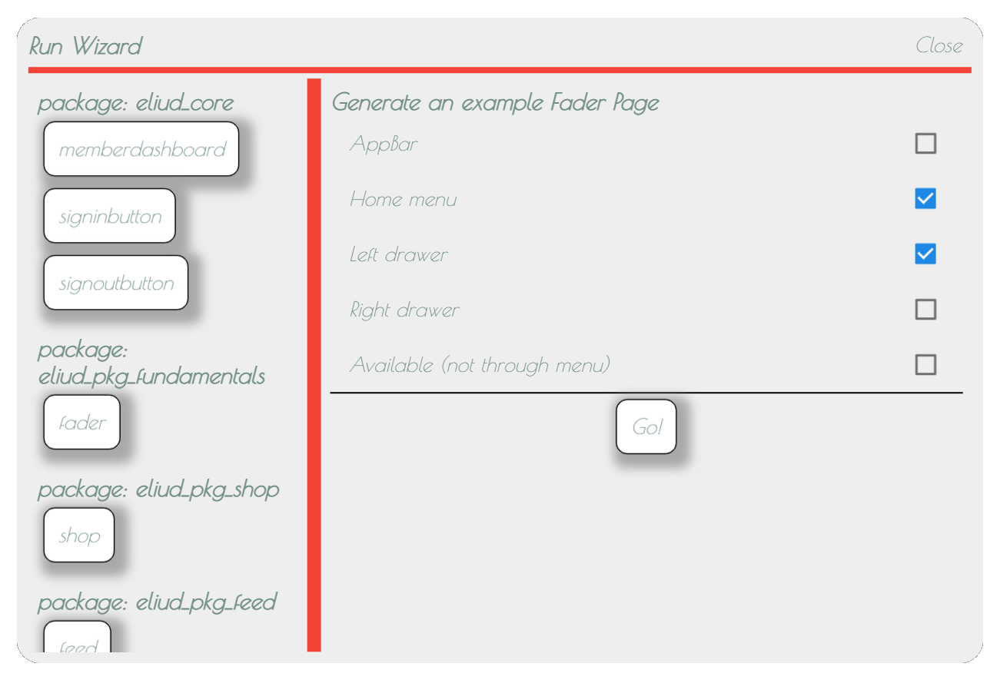

On this wizard page, you can select a package / plugin. After selecting a package, the wizards available in that package are then listed. Click on one of these wizards to configure it and run it. A wizard typically generates 1 or more pages. Also typically, a wizard allows you to indicate from which menu to access these pages, i.e. from the left drawer, right drawer, bottom navigation bar or appbar. Or, you can choose to generate one or more pages and make it available to be referred to from within another page / component.

A wizard simplifies the introduction of functionality to your app. Everything you can do with a wizard can also be done manually through multiple steps by means of the component editor. More on the component editor below.

The list of wizards depends on the packages that are available. Upgrades of packages might introduce new wizards. The current wizards are the below:

| package                 | wizard                 | generates |
|-------------------------|------------------------|-----------|
| eliud_pkg_shop          | shop                   | Generates buttons to + the pages for shopping cart, a shop with some example products, checkout pages, etc|
| eliud_pkg_core          | memberdashboard        | Generates buttons to + a dialog with a memberdashboard component, which allows a member to delete his account, send member data, etc|
|                         | signinbutton           | Generates signin button(s) |
|                         | signoutbutton          | Generates signout button(s) | 
| eliud_pkg_chat          | chat                   | Generates buttons to + the page to the chat |
| eliud_pkg_create        | logo                   | Assigns a new logo to your app |
| eliud_pkg_feed          | feed                   | Generates buttons to + all relevant pages for a feed |
| eliud_pkg_fundamentals  | fader                  | Generates buttons to + a page with a fader |
| eliud_pkg_membership    | membershipdashboard    | Generates buttons to + a dialog that allows the owner of the app to acces the membership dashboard. This allows the owner of the app to maintain its members, i.e. demote / promote members, send messages, ... |
| eliud_pkg_notifications | notificationdashboard  | Generates buttons to + a dialog which allows to send and receive notifications to other members |
| eliud_pkg_text          | welcome                | Generates buttons to + a welcome page |
| eliud_pkg_workflow      | assignment             | Generates buttons to + a page with the assignment component which allows to view assignments / tasks, such as credit card payments, manual payments, handle payments, ship products, etc ... |
| eliud_pkg_wizards       | blocked                | Generates a blocked page. Typically you wouldn't assign this to a menu as you would assign this is as "blocked page" in the editor of the app (see below) |
|                         | about                  | Generates buttons to + an about page |
|                         | policy                 | Generates buttons to + a policy page |
|                         | join membership        | Generates buttons to membership workflow |

## <a name="#app_editor">2.3 App editor</a>

Press the App editor button opens the app dialog. 

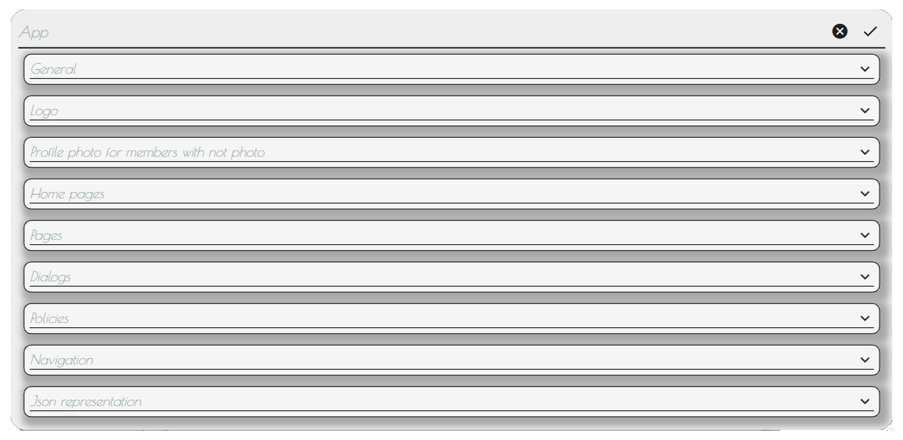

This dialog can be used to configure the following:

### 2.3.1 General

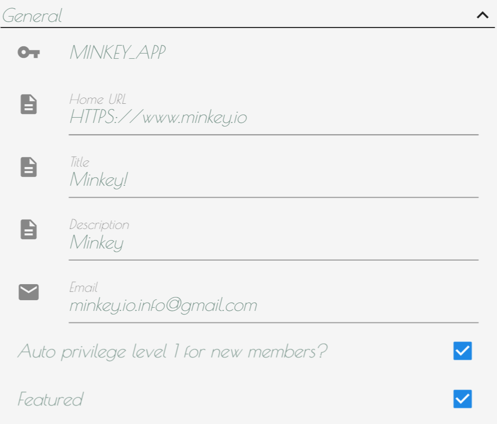

General settings allow to change the web URL, the title, the description and the email address of your app.

The flag "Auto privilege level 1 for new members" allows the owner of the app to indicate that new members of that app should automatically get level 1 privilege. Otherwise there's practically no difference in privilege between a member and a non member. So the app owner might want to give some extra privileges to people subscribing as member. More on privileges later.

The flag "Featured" allows to present your app in Minkey's play store.

### 2.3.2 Logo

Allows to change the logo of your app

### 2.3.3 Profile photo for member with no photo

Allows to set the avatar for people with no photo

### 2.3.4 Profile photo for member with no photo

## <a name="page_editor">2.4 Page editor</a>

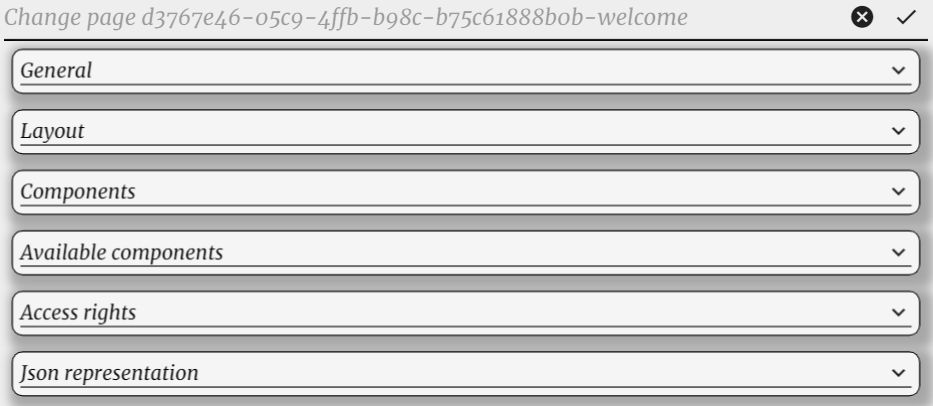

## <a name="app_bar">2.5 App Bar</a>

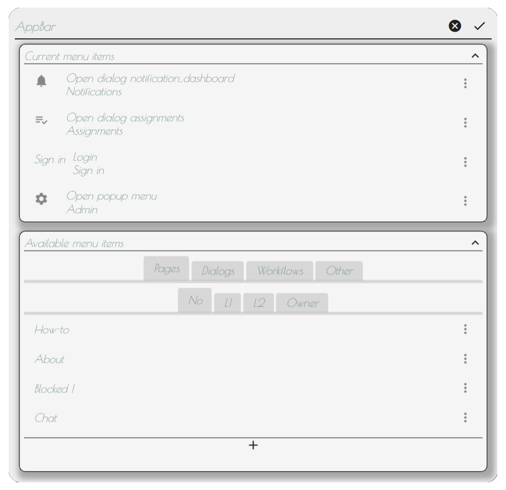

## <a name="bottom_nav">2.6 Bottom Nav</a>

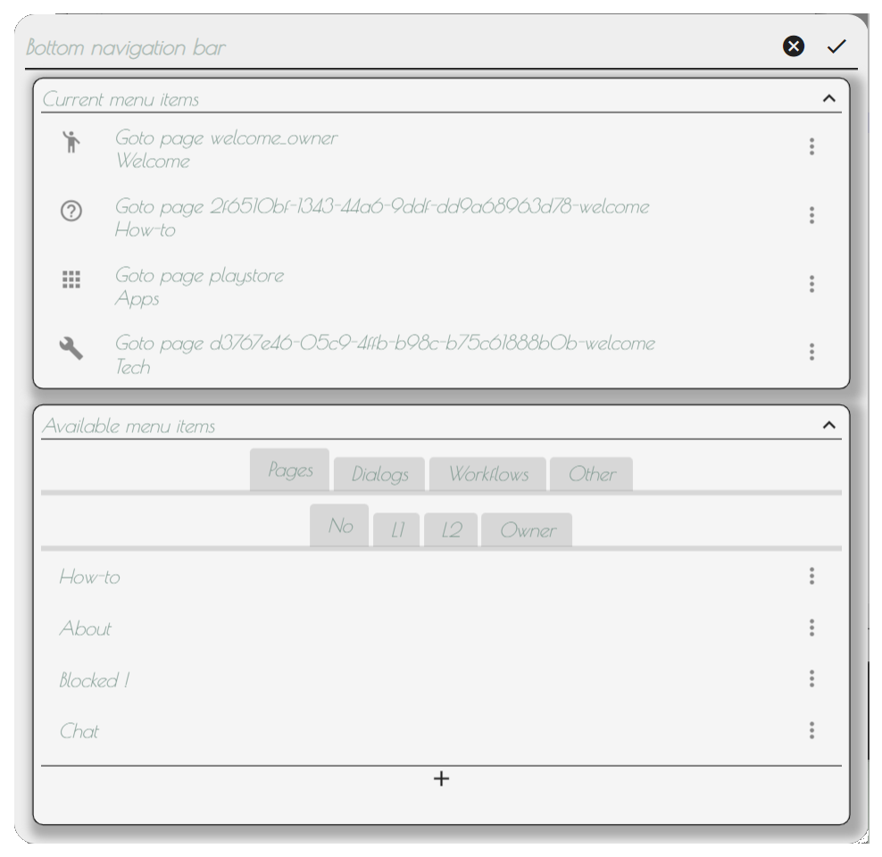

## <a name="drawer">2.7 Drawer</a>

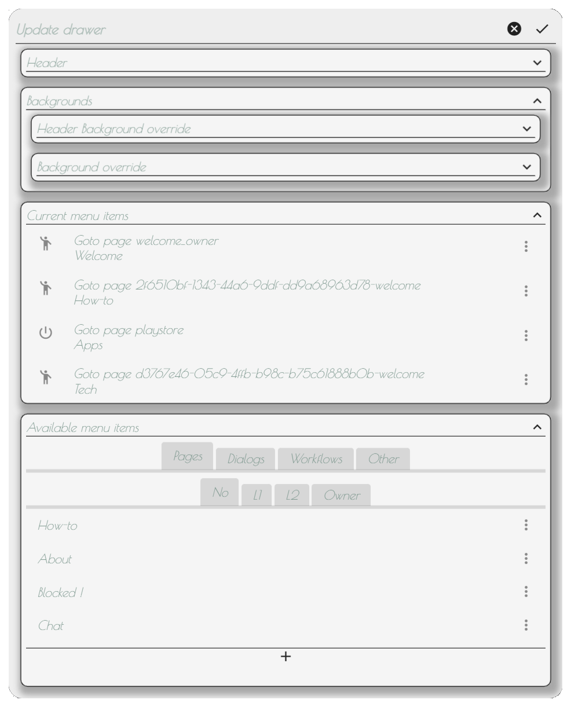

## <a name="component_editor">2.8 Component editor</a>

The component editor is specific to the component. Below the component editor for the component "html". This editor allows you to update the html, as html or visually. The interface allows to upload images, etc. This component editor was used to update this page you are looking at right now.

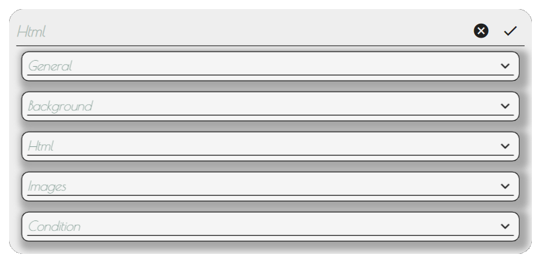

Components are provided by various plugins. More plugins are and will continue to be created and improved. You can write your own plugin with components yourself. Tutorials / manuals available from eliud.io. Plugins and components that exist today:

| Plugin                  | Component identifier      | Description |
|-------------------------|---------------------------|-------------|
| eliud_pkg_shop          | cart                      | Allows to put items in a shopping cart |
|                         | order_overview            | Allows to view your items in your shopping cart |
|                         | pay                       | Allows to pay your order |
|                         | pay_confirmation          | Allows to comfirm your order |
|                         | product_display           | Allows to view details of a product in the shop |
|                         | shop_front                | Allows to display the items in your shop |
| eliud_pkg_core          | member_dashboard          | Allows a member to view his dashboard, delete his account, send member data, etc |
| eliud_pkg_chat          | chat_dashboard            | Allows members of your app to chat |
| eliud_pkg_create        | playstore                 | Allows to create a playstore with multiple in-app apps |
| eliud_pkg_etc           | policy_presentation       | Allows to present a policy, e.g. terms and conditions of your app |
| eliud_pkg_feed          | feed_menu                 | Allows to display the feed menu which includes the feed menu and profile |
|                         | feed_front                | Allows to display the feed only |
|                         | profile                   | Allows to display a member's feed's profile |
| eliud_pkg_folow         | following_dashboard       | Allows a member to see and maintain his followers or people he follows |
|                         | follow_requests_dashboard | Allows a member to view follow requests |
|                         | invite_dashboard          | Allows a member to ask members to follow |
| eliud_pkg_fundamentals  | booklet                   | Allows to present information in a booklet form with sections with an image, text and links |
|                         | decorated_content         | Allows to present another component with some decoration |
|                         | divider                   | Allows to display a divider |
|                         | document                  | Allows to display a document with some contents and images |
|                         | dynamic_widget            | Would allow to display dynamic content, see dynamic\_widget. However, this dependency needs an upgrade and is currently not supported as a result |
|                         | fader                     | Allows to display a fader with images |
|                         | grid                      | Allows to display a grid of components |
|                         | presentation              | Allows to present other components with some images |
|                         | simple_image              | Allows to display an image |
|                         | simple_text               | Allows to present some text |
|                         | tutorial                  | Allows to present a tutorial which is a list of text + images + code |
| eliud_pkg_medium        | album                     | Allows to present an album of images |
| eliud_pkg_membership    | membership_dashboard      |  Allows to present a membership dashboard which should only be accessible by the owner and which allows the owner of the app to maintain its members, i.e. demote / promote members, send messages, ... |
| eliud_pkg_notifications | notification_dashboard    | Allows to send notifications to or receive notifications from other members |
| eliud_pkg_text          | html_with_platform_medium | Allows to present HTML |
| eliud_pkg_workflow      | assignment_view           | Allows to view assignments / tasks, such as credit card payments, manual payments, handle payments, ship products, etc ... |
